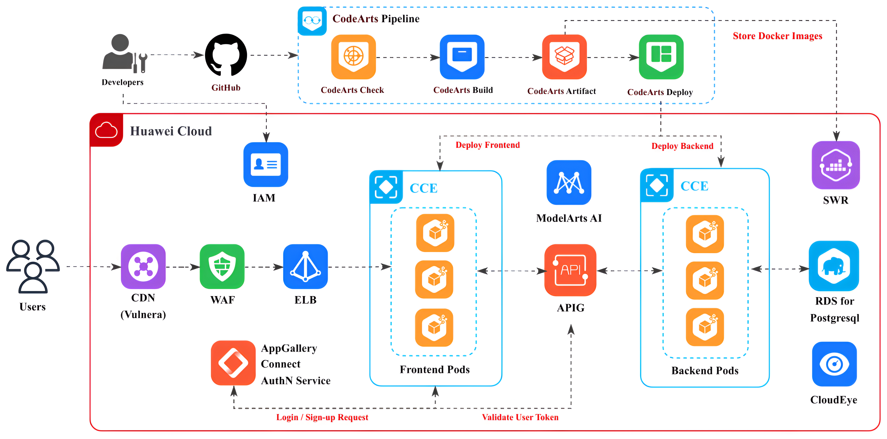

# Vulnera Rust – High-Performance Vulnerability Analysis API

[](LICENSE)
[](https://www.rust-lang.org/tools/install)
[](https://www.huaweicloud.com)

Vulnera is a fast, scalable, multi-ecosystem vulnerability analysis toolkit and testing platform built in Rust. Designed for cloud-native deployment on **Huawei Cloud**, it excels at analyzing dependency manifests while serving as a comprehensive vulnerability analysis and testing toolkit. It aggregates results from OSV, NVD, and GHSA, and exposes a robust HTTP API with OpenAPI documentation. Leveraging async Rust, domain-driven design, and smart caching, Vulnera delivers enterprise-grade reliability and performance.

---

## 🚀 Key Features

- **Multi-Ecosystem Support:** npm, PyPI, Maven/Gradle, Cargo, Go, Packagist, and more
- **Aggregated Vulnerability Data:** Combines OSV, NVD, and GitHub Security Advisories
- **Async & Concurrent:** Built with Tokio for high throughput and bounded concurrency
- **Smart Caching & Recommendations:** Filesystem-based, TTL-configurable cache for reduced API calls; safe version recommendations with upgrade impact classification (major/minor/patch)
- **Domain-Driven Design:** Clean separation of domain, application, infrastructure, and presentation layers
- **OpenAPI Documentation:** Auto-generated Swagger UI for easy API exploration
- **Secure by Default:** Input validation, rate limiting, and secure API handling
- **Huawei Cloud Native:** Optimized for Huawei Cloud services with enterprise-grade architecture
- **Developer Friendly:** Comprehensive tooling, linting, and CI/CD integration

---

## 🌐 Huawei Cloud Architecture



### Architecture Overview

Vulnera leverages Huawei Cloud's enterprise services to deliver a secure, scalable, and highly available vulnerability analysis platform:

#### **Edge & Security Layer**
- **CDN (Vulnera):** Global content delivery with edge caching and acceleration
- **WAF (Web Application Firewall):** Protection against OWASP Top 10 vulnerabilities, DDoS mitigation, and bot management
- **ELB (Elastic Load Balancing):** Distributes traffic across multiple availability zones with health checks and SSL termination

#### **Identity & Access Management**
- **IAM (Identity and Access Management):** Centralized authentication and authorization for users and services
- **AppGallery Connect AuthN Service:** OAuth 2.0 and OpenID Connect integration for frontend authentication

#### **Compute & Container Services**
- **CCE (Cloud Container Engine):** Managed Kubernetes clusters for running containerized workloads
  - **Frontend Pods:** React/Next.js UI served via CCE with auto-scaling
  - **Backend Pods:** Rust API instances with horizontal pod autoscaling based on CPU/memory metrics
- **ModelArts AI:** AI/ML capabilities for future intelligent vulnerability analysis and risk prediction
- **APIG (API Gateway):** API routing, versioning, rate limiting, request/response transformation, and policy enforcement

#### **Data & Storage**
- **RDS for PostgreSQL:** Managed relational database for storing analysis results, user data, and audit logs
- **SWR (Software Repository for Container):** Private container registry for storing Docker images
- **CloudEye:** Real-time monitoring, metrics collection, alerting, and custom dashboards

#### **CI/CD Pipeline (CodeArts)**
- **CodeArts Check:** Code quality analysis, security scanning, and linting
- **CodeArts Build:** Automated build pipeline for Rust backend compilation
- **CodeArts Artifact:** Artifact management and versioning
- **CodeArts Deploy:** Automated deployment to CCE clusters with rollback capabilities
- **Docker Image Storage:** Secure image storage in SWR

### Key Benefits of Huawei Cloud Architecture

✅ **Global Reach:** CDN ensures low-latency access worldwide  
✅ **Enterprise Security:** WAF, IAM, and VPC isolation protect against threats  
✅ **Scalability:** CCE auto-scaling handles traffic spikes seamlessly  
✅ **Reliability:** Multi-AZ deployment with 99.95% uptime SLA  
✅ **Observability:** CloudEye provides comprehensive monitoring and alerting  
✅ **DevOps Integration:** Full CI/CD automation with CodeArts pipeline  
✅ **Cost Optimization:** Pay-as-you-go model with reserved instances for predictable workloads

---

## ⚡ Quick Start

### Installation

#### From Source

```bash
git clone https://github.com/vulnera/vulnera.git
cd vulnera

# Install Rust (stable) if needed
curl --proto '=https' --tlsv1.2 -sSf https://sh.rustup.rs | sh
source ~/.cargo/env

# System dependencies (Ubuntu/Debian)
sudo apt-get install -y pkg-config libssl-dev

# Build and run
cargo build --release
cargo run
```

#### Using Docker

```bash
# Build the Docker image
docker build -t vulnera-rust .

# Run locally
docker run -p 3000:3000 vulnera-rust

# Push to Huawei Cloud SWR
docker tag vulnera-rust swr.cn-north-4.myhuaweicloud.com/vulnera/vulnera-rust:latest
docker push swr.cn-north-4.myhuaweicloud.com/vulnera/vulnera-rust:latest
```

#### Deploy to Huawei Cloud CCE

```bash
# Login to Huawei Cloud
hcloud configure

# Create CCE cluster (if not exists)
hcloud cce cluster create --name vulnera-cluster --region cn-north-4

# Deploy application
kubectl apply -f k8s/deployment.yaml
kubectl apply -f k8s/service.yaml
kubectl apply -f k8s/ingress.yaml
```

---

## 🛠️ Usage

- **API Docs:** `http://localhost:3000/docs` (local) or `https://api.vulnera.com/docs` (production)
- **Health Check:** `http://localhost:3000/health`

### Example: Analyze a Dependency File

```bash
curl -X POST https://api.vulnera.com/api/v1/analyze \
  -H "Content-Type: application/json" \
  -H "Authorization: Bearer YOUR_TOKEN" \
  -d '{
    "file_content": "django==3.2.0\nrequests>=2.25.0",
    "ecosystem": "PyPI",
    "filename": "requirements.txt"
  }'
```

### Example: Analyze a GitHub Repository

```bash
curl -X POST https://api.vulnera.com/api/v1/analyze/repository \
  -H "Content-Type: application/json" \
  -H "Authorization: Bearer YOUR_TOKEN" \
  -d '{
    "repository_url": "https://github.com/rust-lang/cargo",
    "ref": "main"
  }'
```

### Example Response

```json
{
  "summary": {
    "total_dependencies": 15,
    "vulnerable_packages": 2,
    "total_vulnerabilities": 4,
    "severity_counts": {
      "critical": 1,
      "high": 2,
      "medium": 1,
      "low": 0
    }
  },
  "vulnerabilities": [
    {
      "package": "django",
      "version": "3.2.0",
      "ecosystem": "PyPI",
      "severity": "high",
      "cve_id": "CVE-2021-35042",
      "description": "SQL injection vulnerability in Django admin",
      "fixed_versions": ["3.2.5", "3.1.13"],
      "references": ["https://nvd.nist.gov/vuln/detail/CVE-2021-35042"]
    }
  ]
}
```

---

## 📦 Supported Ecosystems & File Formats

| Ecosystem | File Formats | Status |
|-----------|-------------|--------|
| **Python** | `requirements.txt`, `Pipfile`, `pyproject.toml` | ✅ Supported |
| **Node.js** | `package.json`, `package-lock.json`, `yarn.lock` | ✅ Supported |
| **Java** | `pom.xml`, `build.gradle` | ✅ Supported |
| **Rust** | `Cargo.toml`, `Cargo.lock` | ✅ Supported |
| **Go** | `go.mod`, `go.sum` | ✅ Supported |
| **PHP** | `composer.json`, `composer.lock` | ✅ Supported |
| **Ruby** | `Gemfile`, `Gemfile.lock` | ✅ Supported |
| **.NET** | `packages.config`, `*.csproj`, `*.props`, `*.targets` | ✅ Supported |

---

## ⚙️ Configuration

Vulnera is configurable via TOML files in `config/` and environment variables (prefix `VULNERA__`).

### Environment Profiles

- **Development:** `ENV=development` (default)
- **Production:** `ENV=production`

### Configuration Examples

#### Server Configuration

```bash
# Server settings
VULNERA__SERVER__HOST=0.0.0.0
VULNERA__SERVER__PORT=3000

# Database (Huawei Cloud RDS)
VULNERA__DATABASE__HOST=rds-postgres.cn-north-4.myhuaweicloud.com
VULNERA__DATABASE__PORT=5432
VULNERA__DATABASE__NAME=vulnera
VULNERA__DATABASE__USER=vulnera_user
VULNERA__DATABASE__PASSWORD=${DB_PASSWORD}  # Stored in Huawei Cloud Secrets Manager
```

#### Performance Tuning

```bash
# Cache settings
VULNERA__CACHE__TTL_HOURS=24
VULNERA__CACHE__MAX_SIZE_MB=1024

# Concurrent processing
VULNERA__ANALYSIS__MAX_CONCURRENT_PACKAGES=8

# API rate limits
VULNERA__APIS__NVD__API_KEY=${NVD_API_KEY}
VULNERA__APIS__GHSA__TOKEN=${GITHUB_TOKEN}
VULNERA__APIS__GITHUB__MAX_CONCURRENT_FILE_FETCHES=8
```

#### Huawei Cloud Integration

```bash
# CloudEye monitoring
VULNERA__MONITORING__ENABLED=true
VULNERA__MONITORING__ENDPOINT=https://cloudeye.cn-north-4.myhuaweicloud.com

# Logging
VULNERA__LOGGING__LEVEL=info
VULNERA__LOGGING__FORMAT=json
```

---

## 🏗️ Architecture & Design

Vulnera follows **Domain-Driven Design (DDD)** principles with a clean, layered architecture:

### Layers

1. **Domain Layer**
   - Pure business logic and entities
   - Value objects and domain services
   - No external dependencies

2. **Application Layer**
   - Use cases and orchestration
   - Error mapping and validation
   - Transaction management

3. **Infrastructure Layer**
   - API clients (OSV, NVD, GHSA)
   - Parsers for different ecosystems
   - Caching and repository implementations
   - Database access

4. **Presentation Layer**
   - HTTP API endpoints
   - DTOs and request/response models
   - OpenAPI documentation
   - Middleware (auth, rate limiting)

### Core Flow

```
Dependency File
    ↓
Parser (ecosystem-specific)
    ↓
Concurrent Package Processing (configurable parallelism)
    ↓
AggregatingVulnerabilityRepository
    ↓ (parallel API calls)
OSV + NVD + GHSA
    ↓
Merge & Deduplicate
    ↓
AnalysisReport
    ↓
Cache & Return
```

### Caching Strategy

- **Filesystem-based:** SHA256 keys, TTL configurable
- **Future:** Redis integration for distributed caching on Huawei Cloud
- **Cache Key Pattern:** `{ecosystem}:{package}:{version}:{hash}`

---

## ⚡ Performance Tuning

### Concurrent Package Processing

```bash
# Default: 3 packages in parallel (balanced)
VULNERA__ANALYSIS__MAX_CONCURRENT_PACKAGES=3

# High-performance: 8 packages (for better resources)
VULNERA__ANALYSIS__MAX_CONCURRENT_PACKAGES=8

# Conservative: 1 package (for rate-limited environments)
VULNERA__ANALYSIS__MAX_CONCURRENT_PACKAGES=1
```

### Performance Impact

| Setting | Speed | Use Case |
|---------|-------|----------|
| 1 package | Baseline | Strict rate limits |
| 3 packages | ~3x faster | **Default, balanced** |
| 8 packages | ~7x faster | High-resource environments |

### Other Performance Settings

```bash
# Vulnerability data caching
VULNERA__CACHE__TTL_HOURS=24

# File fetching for repository analysis
VULNERA__APIS__GITHUB__MAX_CONCURRENT_FILE_FETCHES=8

# Version query limits
VULNERA__RECOMMENDATIONS__MAX_VERSION_QUERIES_PER_REQUEST=50
VULNERA__RECOMMENDATIONS__EXCLUDE_PRERELEASES=false
```

---

## 🧑‍💻 Development & Contribution

### Development Setup

```bash
# Install development dependencies
make -C scripts/build_workflow install-deps

# Setup pre-commit hooks
pre-commit install

# Run in development mode
make dev
```

### Testing

```bash
# Run all tests
make test

# Run CI checks (lint, format, audit)
make ci-check

# Run specific test suites
cargo test parsers          # Parser tests
cargo test infrastructure   # Infrastructure tests
cargo test integration      # Integration tests
```

### Contribution Guidelines

1. **Fork** the repository
2. **Create** a feature branch (`git checkout -b feature/amazing-feature`)
3. **Commit** your changes (`git commit -m 'Add amazing feature'`)
4. **Test** thoroughly (`make ci-check`)
5. **Document** your changes (update README, OpenAPI specs)
6. **Push** to your branch (`git push origin feature/amazing-feature`)
7. **Open** a Pull Request

Please read `CONTRIBUTING.md` and `CODE_OF_CONDUCT.md` before contributing.

---

## 🚢 Deployment on Huawei Cloud

### Prerequisites

- Huawei Cloud account with CCE and SWR enabled
- `kubectl` and `hcloud` CLI tools installed
- Docker installed locally

### Step-by-Step Deployment

#### 1. Build and Push Docker Image

```bash
# Build the image
docker build -t vulnera-rust:latest .

# Tag for SWR
docker tag vulnera-rust:latest swr.cn-north-4.myhuaweicloud.com/vulnera/vulnera-rust:latest

# Login to SWR
docker login -u cn-north-4@{ACCESS_KEY} -p {SECRET_KEY} swr.cn-north-4.myhuaweicloud.com

# Push to SWR
docker push swr.cn-north-4.myhuaweicloud.com/vulnera/vulnera-rust:latest
```

#### 2. Create CCE Cluster

```bash
# Via Huawei Cloud Console or CLI
hcloud cce cluster create \
  --name vulnera-cluster \
  --region cn-north-4 \
  --vpc-id vpc-xxxxx \
  --subnet-id subnet-xxxxx \
  --node-flavor s6.large.2 \
  --node-count 3
```

#### 3. Configure RDS PostgreSQL

```bash
# Create RDS instance via console or CLI
hcloud rds instance create \
  --name vulnera-db \
  --engine PostgreSQL \
  --version 14 \
  --flavor rds.pg.s3.large.2 \
  --volume-size 100 \
  --region cn-north-4
```

#### 4. Deploy Application

```bash
# Apply Kubernetes manifests
kubectl apply -f k8s/namespace.yaml
kubectl apply -f k8s/configmap.yaml
kubectl apply -f k8s/secret.yaml
kubectl apply -f k8s/deployment.yaml
kubectl apply -f k8s/service.yaml
kubectl apply -f k8s/ingress.yaml

# Verify deployment
kubectl get pods -n vulnera
kubectl get svc -n vulnera
```

#### 5. Configure APIG

```bash
# Create API group
hcloud apig group create --name vulnera-api --region cn-north-4

# Create API routes
hcloud apig api create \
  --group vulnera-api \
  --name analyze \
  --path /api/v1/analyze \
  --method POST \
  --backend-url http://vulnera-service.vulnera.svc.cluster.local:3000
```

#### 6. Setup Monitoring (CloudEye)

```bash
# Configure alarms
hcloud ces alarm create \
  --name vulnera-high-cpu \
  --metric cpu_util \
  --threshold 80 \
  --comparison-operator ">=" \
  --period 300 \
  --evaluation-periods 2
```

---

## 🛡️ Security Considerations

### Huawei Cloud Security Features

- ✅ **IAM Integration:** Role-based access control for all services
- ✅ **VPC Isolation:** Private networking for CCE, RDS, and backend services
- ✅ **WAF Protection:** OWASP Top 10, DDoS mitigation, and bot management
- ✅ **SSL/TLS:** End-to-end encryption via ELB and APIG
- ✅ **Secrets Management:** Sensitive data stored in Huawei Cloud Secrets Manager
- ✅ **Security Groups:** Firewall rules restrict access to authorized IPs/ports
- ✅ **Audit Logging:** CloudEye tracks all API calls and administrative actions

### Application Security

- Input validation and sanitization
- Rate limiting (10,000 requests/hour per user)
- API key authentication
- Non-root container execution
- Dependency scanning in CI/CD pipeline

---

## 🐞 Troubleshooting

### Common Issues

#### Build Errors

```bash
# Update Rust toolchain
rustup update stable

# Install system dependencies
sudo apt-get install -y pkg-config libssl-dev build-essential
```

#### API Rate Limits

```bash
# Set API keys in environment
export VULNERA__APIS__NVD__API_KEY=your_nvd_key
export VULNERA__APIS__GHSA__TOKEN=your_github_token
```

#### Cache Issues

```bash
# Clear cache directory
rm -rf .vulnera_cache

# Or adjust TTL
export VULNERA__CACHE__TTL_HOURS=12
```

#### Database Connection Issues

```bash
# Check RDS connectivity
telnet rds-postgres.cn-north-4.myhuaweicloud.com 5432

# Verify credentials
psql -h rds-postgres.cn-north-4.myhuaweicloud.com -U vulnera_user -d vulnera
```

#### Debug Logging

```bash
# Enable debug logs
VULNERA__LOGGING__LEVEL=debug cargo run
```

---

## 📜 Changelog

See [CHANGELOG.md](CHANGELOG.md) for version history and release notes.

**Latest Updates:**
- ✅ Migrated to Huawei Cloud architecture
- ✅ Safe version recommendations with upgrade impact analysis
- ✅ Extended registry support (Packagist, Go proxy, Maven Central)
- ✅ Next safe minor version hints
- ✅ Prerelease exclusion toggle
- ✅ Request-level caps on version queries

---

## 🦀 Why Rust?

| Feature | Rust | Python |
|---------|------|--------|
| **Performance** | Compiled, zero-cost abstractions | Interpreted, slower runtime |
| **Concurrency** | True parallelism with Tokio | GIL-limited async |
| **Memory Safety** | Compile-time guarantees | Runtime errors possible |
| **Type Safety** | Strict static typing | Dynamic typing |
| **Security** | No buffer overflows, use-after-free | Vulnerable to memory issues |
| **Ecosystem** | Modern tooling (cargo, clippy) | Mature but slower libraries |
| **Scalability** | Handles 10,000+ req/sec | Limited by GIL and interpreter |

---

## 👥 Team


- **Amr Medhat** — Cloud Engineer (Huawei Cloud Specialist)
- **Gasser Mohammed** — Frontend Developer
- - **Khaled Mahmoud** — Project Manager, Main Developer, Rust Backend Developer
- **Abd El-Rahman Mossad** — Frontend Developer (Extension), LSP Server Developer and Maintainer

---

## 📝 License

**AGPL v3.0 or later** — See [LICENSE](./LICENSE)

---

## 🌐 Vulnera Frontend

Looking for the web UI?  
Visit the official Vulnera Frontend: [https://github.com/k5602/Vulnera-Frontend](https://github.com/k5602/Vulnera-Frontend)

---

## 🗺️ Roadmap: Next Features

### Toolkit Expansions

- **SBOM Generation:** CycloneDX/SPDX support with dependency graph visualization
- **Container Scanning:** Docker image vulnerability analysis (Trivy-like capabilities)
- **Secrets Detection:** Scan for exposed API keys, tokens, and credentials
- **SAST Integration:** Basic static analysis rules for common vulnerabilities
- **IaC Scanning:** Terraform/Kubernetes manifest analysis with policy violations
- **SARIF Export:** Standardized output format for CI/CD integrations

### Editor Ecosystem

- **VS Code Extension:** Live diagnostics, quick fixes, inline severity indicators
- **LSP Server:** Language Server Protocol implementation (Rust, JSON-RPC/stdio)
  - Neovim integration via nvim-lspconfig
  - Zed editor support with extension
  - On-save analysis and code actions
- **Custom Protocol:** `vulnera/analyzeProject` method for project-wide scans

### Platform & Backend

- **Redis Caching:** Optional distributed cache backend for Huawei Cloud
- **OpenTelemetry:** Distributed tracing and metrics collection
- **CloudEye Dashboards:** Enhanced monitoring with custom dashboards
- **OAuth Integration:** Huawei Cloud IAM and AppGallery Connect AuthN
- **RBAC:** Role-based access control with audit logs
- **Offline Mode:** Air-gapped deployments with mirrored OSV/NVD snapshots

### Future Enhancements

- **Dependency Upgrade Assistant:** Safe version bump planner per ecosystem
- **Risk Scoring:** CVSS + exploit signals + package health metrics
- **Webhook Support:** GitHub/GitLab app integration for automated PR comments
- **SBOM Endpoint:** POST SBOM → normalized analysis → report
- **Multi-Tenancy:** Organization/project model with usage quotas

---

## 🔐 Security Policy

### Responsible Disclosure

- Report vulnerabilities via **GitHub Security Advisories**
- Target response time: **within 72 hours**
- Do not open public issues for security reports

### Secret Management

- Use **Huawei Cloud Secrets Manager** for sensitive data
- Leverage **IAM roles** instead of long-lived credentials
- Never commit secrets to version control

### Compliance

- SOC 2 Type II compliance roadmap
- GDPR-compliant data handling
- Regular security audits and penetration testing

---

## 🔁 Versioning & Releases

- **Semantic Versioning (SemVer):** MAJOR.MINOR.PATCH
- Release notes published in [GitHub Releases](https://github.com/vulnera/vulnera/releases)
- Breaking changes highlighted in release notes
- All releases are tagged for easy rollback

---

## 📞 Support & Contact

- **Documentation:** [https://docs.vulnera.com](https://docs.vulnera.com)
- **Issues:** [GitHub Issues](https://github.com/vulnera/vulnera/issues)
- **Email:** support@vulnera.com
- **Community:** [Discord Server](https://discord.gg/vulnera)

---

**Built with ❤️ by the Vulnera Team | Powered by Huawei Cloud**
